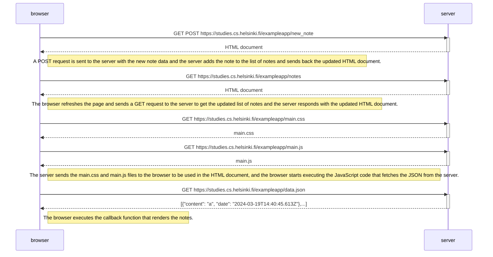

# 0.4 diagram

```mermaid
sequenceDiagram
    participant browser
    participant server

    browser->>server: GET POST https://studies.cs.helsinki.fi/exampleapp/new_note
    activate server
    server-->>browser: HTML document
    deactivate server

    Note right of browser: A POST request is sent to the server with the new note data and the server adds the note to the list of notes and sends back the updated HTML document.

    browser->>server: GET https://studies.cs.helsinki.fi/exampleapp/notes
    activate server
    server-->>browser: HTML document
    deactivate server

    Note right of browser: The browser refreshes the page and sends a GET request to the server to get the updated list of notes and the server responds with the updated HTML document.

    browser->>server: GET https://studies.cs.helsinki.fi/exampleapp/main.css
    activate server
    server-->>browser: main.css
    deactivate server

    browser->>server: GET https://studies.cs.helsinki.fi/exampleapp/main.js
    activate server
    server-->>browser: main.js
    deactivate server

    Note right of browser: The server sends the main.css and main.js files to the browser to be used in the HTML document, and the browser starts executing the JavaScript code that fetches the JSON from the server.

    browser->>server: GET https://studies.cs.helsinki.fi/exampleapp/data.json
    activate server
    server-->>browser: [{"content": "a", "date": "2024-03-19T14:40:45.613Z"},...]
    deactivate server

    Note right of browser: The browser executes the callback function that renders the notes.
```
