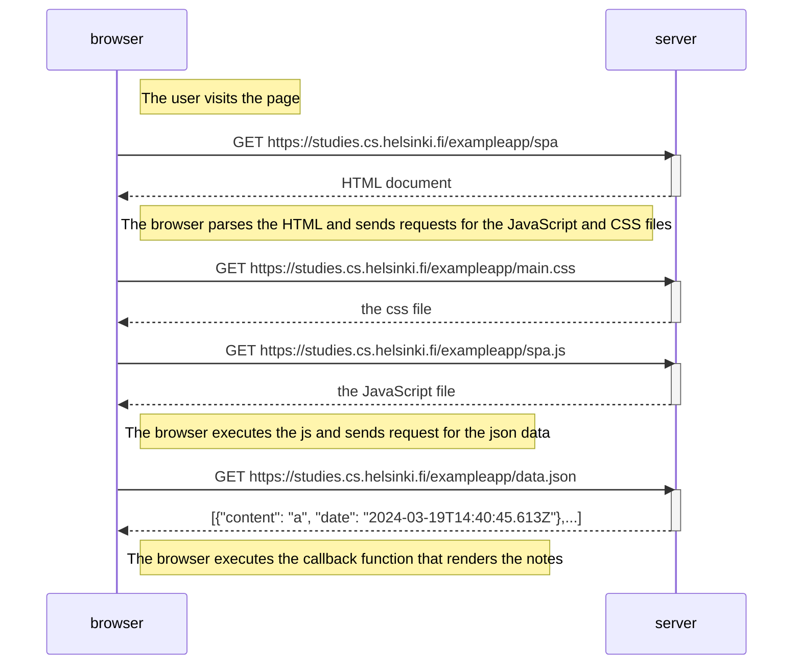

# 0.5 diagram

```mermaid
sequenceDiagram
    participant browser
    participant server

    Note right of browser: The user  visits the page

    browser->>server: GET https://studies.cs.helsinki.fi/exampleapp/spa
    activate server
    server-->>browser: HTML document
    deactivate server

    Note right of browser: The browser parses the HTML and sends requests for the JavaScript and CSS files
    
    browser->>server: GET https://studies.cs.helsinki.fi/exampleapp/main.css
    activate server
    server-->>browser: the css file
    deactivate server

    browser->>server: GET https://studies.cs.helsinki.fi/exampleapp/spa.js
    activate server
    server-->>browser: the JavaScript file
    deactivate server

    Note right of browser: The browser executes the js and sends request for the json data

    browser->>server: GET https://studies.cs.helsinki.fi/exampleapp/data.json
    activate server
    server-->>browser: [{"content": "a", "date": "2024-03-19T14:40:45.613Z"},...]
    deactivate server

    Note right of browser: The browser executes the callback function that renders the notes
```