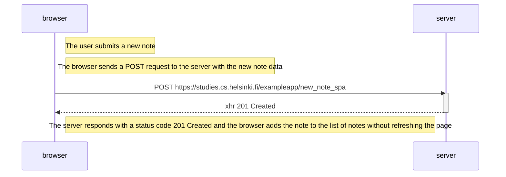

# 0.6 diagram

```mermaid
sequenceDiagram
    participant browser
    participant server

    Note right of browser: The user submits a new note

    Note right of browser: The browser sends a POST request to the server with the new note data

    browser->>server: POST https://studies.cs.helsinki.fi/exampleapp/new_note_spa
    activate server
    server-->>browser: xhr 201 Created
    deactivate server

    Note right of browser: The server responds with a status code 201 Created and the browser adds the note to the list of notes without refreshing the page 
```